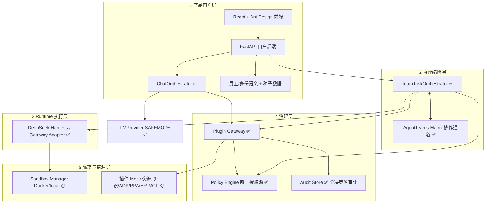

# 数字员工平台 Demo — 系统架构

> 版本：v0.3（2026-08-17，Sprint 1.5 Architecture Freeze）
> 状态：实现依据。Sprint 1 骨架已按本架构落地；未实现模块以「📋 契约预留」标注，后续 Sprint 按此基线开发。
> 配套文档：`PLANS.md`、`API_CONTRACT.md`（冻结版）、`SECURITY_BOUNDARY.md`、`DEVELOPMENT_HANDOFF.md`。
> 定位：券商内部汇报 PoC，一周工期，四人团队（2 正式 + 2 实习生，实习生无数据权限）。

## 1. 设计原则

1. **薄门户 + 复用底层**：门户只做企业语义与演示编排，不重复实现 AgentTeams / DeepSeek Harness 已有能力。
2. **唯一授权源**：所有权限判断只在 Policy Engine；前端、Runtime、插件内部不得散落权限逻辑。
3. **唯一执行入口**：所有资源调用统一经过 Plugin Gateway，业务模块禁止直连知识库、数据库、Workflow 或 RPA。
4. **Sandbox 只隔离、不授权**：Sandbox 是执行层强制隔离，不是权限定义来源。
5. **默认拒绝**：未显式授权的动作一律 Deny，并写入审计。
6. **LLM 安全模式**：进入 LLM 的内容必须全部来自虚构数据（`source=demo`）。
7. **可重复**：一键 reset + 种子数据，演示可重复执行。

## 2. 五层架构

### 当前协同主链（Sprint 12）

```text
用户消息
  → 数字分身：识别任务、按授权名册生成角色计划
  → TaskRun(running)：先持久化任务与触发消息 seq
  → AgentTeams：只做讨论、认领、风险提示（所有事件携带 task_id）
  → 数字员工：每人建立独立 Harness 上下文，注入身份、职责、Task ID 与协作结论
  → DeepSeek Harness：形成该员工的受控工具调用计划
  → Policy → Plugin Gateway → Plugin Adapter Tool：执行一次真实业务动作
  → Approval：批准后重新执行原子任务，不把批准当执行结果
  → 数字分身：汇总并回写会话/任务卡片
```

角色边界：`twin` 是每位真人的对话组织者，不创建 AgentTeams worker；
`virtual/rpa` 是独立执行身份，绑定 AgentTeams worker，并以 Harness 作为平台执行引擎。
AgentTeams 不直接触发业务副作用，避免协作超时后产生双重报销、采购或 RPA 操作。

### 统一能力契约与单次执行边界（Sprint 13）

```text
Capability Contract v1.0
  ├─ Skill: instruction / executable=false / prompt 注入
  └─ Plugin: knowledge|mcp|workflow|rpa|http / executable=true
       → Identity → Policy → Gateway
       → executor.primary=harness：员工 Harness 先形成工具调用计划
       → executor.tool=adapter：Gateway 再调用一次获授权 Adapter 工具
       → Harness 未启用/不可用：明确标记 Demo Adapter 降级并调用一次工具
       → Audit
```

Harness 位于 Gateway 内部、业务 Adapter 的上游。VE-0002、VE-0003、RPA-0001、VE-0004
分别持有独立 `DSH_HOME` 与 workspace；每次调用的上下文 ID 为 `员工工号:Task ID`。
Plugin Adapter 是 Harness 可请求的平台受控工具，不是替代 Harness 的业务执行器；纯模型文本只作为计划摘要，
只有 Adapter 回执可以把子任务标记为完成。Harness 未启用或失败时，UI 明确显示 `Demo Adapter 降级`。



### 各层职责与当前状态

| 层 | 组件 | 职责 | Sprint 1/1.5 状态 |
|---|---|---|---|
| 1 产品门户层 | React + FastAPI | 员工/数字分身/虚拟员工语义，聊天编排，团队任务入口，配置与展示 | ✅ 前端骨架 + 后端 CRUD + Chat 编排（Sprint 4）；Team 编排 📋 |
| 2 协作编排层 | TeamTaskOrchestrator；AgentTeams Matrix 通道 | 唯一任务状态机、角色拆解、讨论/认领反馈、审批流转 | ✅ Sprint 12 |
| 3 Runtime 执行层 | DeepSeek Harness / Gateway Adapter | 数字员工的受控执行；外部工具一律经 Plugin Gateway | ✅ Sprint 12（Harness 可配置启用） |
| 4 治理层 | Policy Engine / Plugin Gateway / Audit Store | 授权、插件执行入口、全链路审计 | ✅ Sprint 2 已实现（评估/执行/审计链路接通） |
| 5 隔离与资源层 | Sandbox Policy + Mock Executor（Sprint 3）+ 插件 Mock 资源 | 网络/目录/位置隔离；虚构知识库与 Mock 系统 | Mock 资源 ✅；Sandbox Policy + Mock Executor ✅；Docker 真启动 📋 |

## 3. 模块职责

| 模块 | 职责 | 明确不做 | 状态 |
|---|---|---|---|
| LLMProvider | 唯一持有 DeepSeek Key 的代码点；统一 chat/tool_call/structured_output；SAFEMODE 校验所有 prompt 段来源 | 不做多模型路由；不持有真实数据 | ✅ Sprint 4 |
| ChatOrchestrator | 单聊编排；内置轻量 Agent 循环（最多 3 轮工具调用）；整段 JSON（SSE 弹性） | 不直接评估策略；不直连插件 | ✅ Sprint 4 |
| TeamTaskOrchestrator | 先持久化唯一 `task_run`；模板 + LLM 补全/汇总；审批挂起与批准后续跑 | 不做通用调度器、动态 Worker 招聘 | ✅ Sprint 12 |
| Policy Engine | `evaluate(subject, resource, action, context) -> allow/deny/approval + reason`；默认拒绝 | 不执行工具；不创建容器；不暴露给前端 | ✅ Sprint 2（内置规则 POLICY-001~005 等） |
| Plugin Gateway | 唯一插件执行入口：policy → Mock 凭据注入 → Adapter → 审计 | 不做授权决策 | ✅ Sprint 2 |
| RuntimeAdapter | 统一 Harness/Gateway 执行接口；Harness 不可用时保留 Gateway 结果 | 不做权限判断；AgentTeams 协作消息不作为业务执行结果 | ✅ Sprint 12 |
| Sandbox Policy + MockExecutor | SandboxPolicy 模型（runtime_location/internet_access/filesystem_scope）+ Mock 执行；先 Policy 后执行 | 不产生授权决策 | ✅ Sprint 3（Docker 真启动 📋） |
| Audit Store | 追加式写入事件；按 trace_id 聚合为 Trace 时间线 | 不参与执行路径 | ✅ Sprint 2（Gateway 全决策落审计；Trace 时间线接口 📋） |
| 前端 | 展示与表单收集；渲染协作动态、执行来源、Policy Denied、审批卡 | 不解释/不执行权限 | ✅ Sprint 12 |

## 4. 统一资源访问链（强制）

**业务模块（前端、ChatOrchestrator、TeamTaskOrchestrator、Runtime、插件内部）不得直接访问知识库、数据库、Workflow 或 RPA。**

所有资源调用必须依次经过：

```text
Employee Identity
      ↓
Policy Engine（唯一授权源，默认拒绝）
      ↓
Plugin Gateway（唯一执行入口）
      ↓
Adapter（Runtime / Knowledge / Workflow / RPA）
      ↓
Enterprise Resource（Mock 或受控真实资源）
```

规则：
- 只有 Policy Engine 能产出授权决策；Gateway 只转发与审计，不重复判断。
- Adapter 不持有权限逻辑，只做协议适配与调用。
- 每条调用链必须产生一条 `audit_event`（allow / deny / approval）。
- 前端展示的「允许/拒绝」信息必须来自后端决策结果，前端不得自行判断。

## 5. 数据模型（Sprint 1 实际实现）

表（SQLAlchemy，`backend/app/models.py`）：

| 表 | 说明 | 备注 |
|---|---|---|
| `human_employee` | 真实员工（正式/实习） | ✅ |
| `digital_employee` | 数字员工统一表 | ✅ |
| `plugin` | 插件登记 | ✅ |
| `employee_plugin_grant` | 员工 × 插件授权（allow/deny/approval） | ✅ |
| `policy` | 策略定义 | ✅ |
| `audit_event` | 审计事件 | ✅ |
| `team` / `team_member` | 团队与成员 | ✅ |
| `knowledge_base` | 知识库登记（内容在 `mock-data/kb/`） | ✅ |
| `chat_session` / `chat_message` | 会话与消息 | ✅ 表已建，接口 📋 |
| `task_run` | 团队任务 | ✅ 表已建，编排 📋 |

**已冻结的建模决策**：
- DigitalTwin / VirtualEmployee 不是独立表，由 `digital_employee.type = twin | virtual | rpa` 区分。
- RuntimeBinding 不建独立表：Runtime 绑定信息内嵌于 `digital_employee`（`runtime_type` / `runtime_ref`），Sandbox 策略内嵌（`location` / `internet` / `max_data_level` / `allowed_domains`）。P0-lite 场景一个员工一个 Runtime，内嵌足够；若后续需要「一员工多 Runtime」再独立建模，需 A 批准并走契约变更。

## 6. 不变量（实现必须遵守）

- Policy Engine 仅被 Plugin Gateway 与 RuntimeLauncher 两个调用方使用。
- 任何插件执行必须产生一条 `audit_event`（allow / deny / approval）。
- 进入 LLM 的每个 prompt 段必须带 `source=demo`，SAFEMODE 强制校验，否则拒发。
- 所有员工/插件/策略数据来自种子（`mock-data/`），本周无真实数据源。
- `trace_id` 贯穿 chat / team / plugin / runtime，一个用户请求一个 trace。
- Deny 优先级 > Approval > Allow；未授权即 Deny。

## 7. 技术栈与运行方式

| 项 | 选型 |
|---|---|
| 前端 | React 18 + TypeScript + Vite + Ant Design 5 |
| 后端 | FastAPI + SQLAlchemy + SQLite（PoC）；pydantic v2 |
| LLM | DeepSeek OpenAI 兼容 API（`DEEPSEEK_API_KEY` / `DEEPSEEK_BASE_URL`，环境变量注入）📋 |
| Harness | 本机外部依赖 `deepseek-harness/`，`pnpm dsh --profile headless`（P1 门禁项）📋 |
| Sandbox | Docker（python:3.11-slim + 挂载工作区）或 local 降级 📋 |
| 一键启动 | `scripts/init_demo.ps1`（环境 + 种子）；`run_demo.ps1` 规划中 |

启动详见 `README.md` 与 `docs/DEVELOPMENT_HANDOFF.md`。

## 8. 目录结构（约定）

```text
logicalNpc/
  frontend/          # React 应用（页面、API client、测试）
  backend/           # FastAPI 应用（app/routers、app/models.py、tests/）
  adapters/          # Runtime / Knowledge / Workflow / RPA Adapter 预留（仅契约，无实现）
  mock-data/         # 虚构种子 JSON + 虚构知识库（L1/L2）
  tests/             # 测试布局索引（测试就近存放：backend/tests、frontend/src）
  shared-schema/     # 前后端统一 TS 类型（与 OpenAPI 同步）
  scripts/           # init_demo / reset_demo（规划）
  docs/              # 架构、安全边界、API 契约、交接文档、演示脚本
  PLANS.md           # 任务清单
```

外部依赖不入库：`deepseek-harness/`、`higress/` 为本机引用（gitignore）；`secure-overlay/` 位于仓库外，仅正式员工机器存在。
