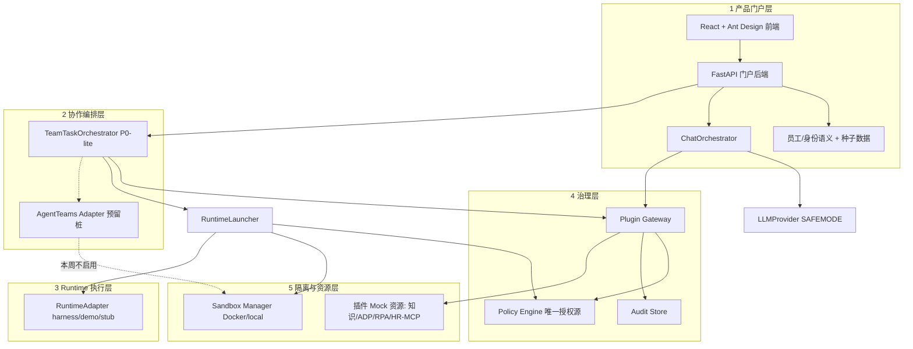

# 数字员工平台 Demo — 系统架构

> 版本：v0.2（2026-08-17，评审定稿）
> 状态：实现依据。与 `PLANS.md`、`API_CONTRACT.md`、`SECURITY_BOUNDARY.md` 配套使用。
> 定位：券商内部汇报 PoC，一周工期，四人团队（2 正式 + 2 实习生，实习生无数据权限）。

## 1. 设计原则

1. **薄门户 + 复用底层**：门户只做企业语义与演示编排，不重复实现 AgentTeams / DeepSeek Harness 已有能力。
2. **唯一授权源**：所有权限判断只在 Policy Engine；前端、Runtime、插件内部不得散落权限逻辑。
3. **唯一执行入口**：所有插件调用统一经过 Plugin Gateway。
4. **Sandbox 只隔离、不授权**：Sandbox 是执行层强制隔离，不是权限定义来源。
5. **默认拒绝**：未显式授权的动作一律 Deny，并写入审计。
6. **LLM 安全模式**：进入 LLM 的内容必须全部来自虚构数据（`source=demo`）。
7. **可重复**：一键 reset + 种子数据，演示可重复执行。

## 2. 五层架构



### 各层职责

| 层 | 组件 | 职责 |
|---|---|---|
| 1 产品门户层 | React + FastAPI | 员工/数字分身/虚拟员工语义，聊天编排，团队任务入口，配置与展示 |
| 2 协作编排层 | TeamTaskOrchestrator（P0-lite）；AgentTeams Adapter（预留） | 模板化任务 + LLM 补全/汇总、子任务分发、审批流转 |
| 3 Runtime 执行层 | RuntimeAdapter（harness / demo / openclaw-stub / agentteams-stub） | 虚拟员工的受控执行；外部工具一律经 Plugin Gateway |
| 4 治理层 | Policy Engine / Plugin Gateway / Audit Store | 授权、插件执行入口、全链路审计 |
| 5 隔离与资源层 | Sandbox Manager（Docker / local）+ 插件 Mock 资源 | 网络/目录/位置隔离；虚构知识库与 Mock 系统 |

## 3. 模块职责

| 模块 | 职责 | 明确不做 |
|---|---|---|
| LLMProvider | 唯一持有 DeepSeek Key 的代码点；统一 chat 接口；SAFEMODE 校验所有 prompt 段来源 | 不做多模型路由；不持有真实数据 |
| ChatOrchestrator | 单聊编排；内置轻量 Agent 循环（最多 3 轮工具调用）；SSE 输出 | 不直接评估策略；不直连插件 |
| TeamTaskOrchestrator | 模板 + LLM 补全/汇总；`task_run` + JSON `subtasks`；审批挂起与续跑 | 不做通用调度器、动态 Worker 招聘 |
| Policy Engine | `evaluate(subject, resource, action, context) -> allow/deny/approval + reason`；默认拒绝 | 不执行工具；不创建容器；不暴露给前端 |
| Plugin Gateway | 唯一插件执行入口：policy → Mock 凭据注入 → Adapter → 审计 | 不做授权决策 |
| RuntimeAdapter | 统一 Runtime 接口；`harness` 真接或 `demo` 演示模式；OpenClaw/AgentTeams 为桩 | 不做权限判断 |
| Sandbox Manager | Docker / local 双后端；network=none、目录挂载、超时控制；记录 Sandbox 决策 | 不产生授权决策 |
| Audit Store | 追加式写入事件；按 trace_id 聚合为 Trace 时间线 | 不参与执行路径 |
| 前端 | 展示与表单收集；渲染工具卡片、Policy Denied、审批卡 | 不解释/不执行权限 |

## 4. 关键数据流

**单聊（数字分身 / 虚拟员工）**

`POST /employees/{id}/chat` → ChatOrchestrator 建 trace → LLMProvider（SAFEMODE）→ 模型请求工具 → PluginGateway → Policy Engine 评估 → Adapter 执行 → Audit → 工具结果注入 → 继续循环（≤3 轮）→ SSE 回答。

**团队任务（P0-lite）**

`POST /teams/{id}/tasks` → TeamTaskOrchestrator 建 trace → 预置模板 + LLM 补全子任务 → 逐子任务经 PluginGateway / RuntimeLauncher 执行 → 遇 Approval 挂起 → `POST /tasks/{id}/approve` 后续跑 → Leader 汇总 → 完成。

**Runtime 执行**

RuntimeLauncher 先调 Policy Engine（环境上下文取自 subject 绑定的 `sandbox_policy` 配置，而非 Sandbox 运行时报告）→ 获准后启动 SandboxManager（Docker 或 local）→ 经 RuntimeAdapter 执行 → 结果 + 审计回传。

**Deny 演示**

LLM 尝试调用绑定为 `decision_mode=deny` 的插件（如 internet_search / L3 数据）→ Gateway → Policy Deny → 前端渲染「Policy Denied + 策略 ID + 原因」卡片。

## 5. 不变量（实现必须遵守）

- Policy Engine 仅被 Plugin Gateway 与 RuntimeLauncher 两个调用方使用。
- 任何插件执行必须产生一条 `audit_event`（allow / deny / approval）。
- 进入 LLM 的每个 prompt 段必须带 `source=demo`，SAFEMODE 强制校验，否则拒发。
- 所有员工/插件/策略数据来自种子（`demo-data/`），本周无真实数据源。
- `trace_id` 贯穿 chat / team / plugin / runtime，一个用户请求一个 trace。
- Deny 优先级 > Approval > Allow；未授权即 Deny。

## 6. 技术栈与运行方式

| 项 | 选型 |
|---|---|
| 前端 | React 18 + TypeScript + Vite + Ant Design 5 |
| 后端 | FastAPI + SQLAlchemy + SQLite（PoC）；pydantic v2 |
| LLM | DeepSeek OpenAI 兼容 API（`DEEPSEEK_API_KEY` / `DEEPSEEK_BASE_URL`，环境变量注入） |
| Harness | 本机外部依赖 `deepseek-harness/`，`pnpm dsh --profile headless`（P1 门禁项） |
| Sandbox | Docker（python:3.11-slim + 挂载工作区）或 local 降级 |
| 一键启动 | `scripts/run_demo.ps1`（前端 dev + uvicorn + 可选 docker） |

## 7. 目录结构（约定）

```text
logicalNpc/
  frontend/          # React 应用
  backend/           # FastAPI 应用（api/core/models/schemas/services/adapters）
  shared-schema/     # OpenAPI 导出与前端类型（契约单一来源）
  demo-data/         # 虚构知识库 L1/L2、种子 JSON、场景脚本
  docker/            # sandbox 镜像与 compose
  scripts/           # init_demo / reset_demo / run_demo
  docs/              # 架构、安全边界、API 契约、演示脚本
  PLANS.md           # 任务清单
```

外部依赖不入库：`deepseek-harness/`、`higress/` 为本机引用（gitignore）；`secure-overlay/` 位于仓库外，仅正式员工机器存在。
